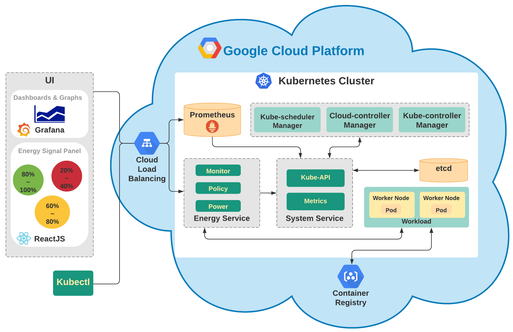

# Kube-flux ⚡️⚡️⚡️
#### A smarter Datacenter!

# Overview
Our project modifies a kubernetes deployment to modify workloads to take into consideration energy budget. The goal is to build energy aware datacenters and ultimately reduce energy consumption to help build a greener planet. 

We use Kubernetes, a technology that is lighter weight than a virtual machine while also providing greater bin packing even as it shrinks an application to ensure successful deployments. We also use Golang, Terraform, and React in building a Kubernetes energy-aware datacenter in GCP.

# Table of Contents
- [Features](#features)
- [Rebuild Instructions](#rebuild-instructions)
- [For the Future](#for-the-future)
- [Project Maintainers](#project-maintainers)

# Features
#### Architecture Diagram

###### Front-end
+ **Grafana** - UI that queries the data saved in Prometheus using PromQL and displays the change in CPU usage, number of pods running, dynamically with graphs and visualization.
+ **Energy Signal Panel** - UI for admin to input an external energy signal,  check current status of the signal and view the number of pods running inside Kubernetes
+ **kubectl** - Command line tool that enables us to deploy and manage workloads in kubernetes.
###### Back-end
+ **Cloud Load Balancing** - Load Balancer that redirects external traffic to specific services running inside Kubernetes.
+ **Prometheus** - Time series database that pulls the data from metrics server and saves in JSON format
+ **Monitor** - Internal monitor that fetches data & updates the cluster
+ **Policy** - the system’s energy signal receiver
+ **Power** - the system’s energy signal responder
+ **Kube API** - API allows the users, different parts of the system communicate with each other
+ **Metrics** - Server that stores information about the cluster such as CPU and  Memory usages of pods running inside the cluster.
+ **Node** - A physical or virtual machine that can run multiple pods.
+ **Pod** - A smallest execution unit inside kubernetes. It contains a collection of container images and a specific IP address.
+ **Container Registry** - A registry to store container images in the cloud.
+ **Kube-scheduler Manager** - Watches for newly created pods and makes sure that pods are matched to nodes.
+ **Cloud-controller Manager** - Kubernetes control plane component that embeds cloud specific control logic. It lets the user link the cluster into the cloud provider’s API.
+ **Kube-controller Manager** - A daemon that embeds the core control loops shipped with Kubernetes.

# Rebuild Instructions
This document shows you how to re-build the whole project.

## Terraform:
Our system runs on Kubernetes cluster, the first step is to deploy a cluster on Google Kubernetes Engine.

Terraform is an open-source infrastructure as code software tool to provision data center infrastructure.
For installation, please refer to [install-guide](https://learn.hashicorp.com/tutorials/terraform/install-cli)
+ `terraform/cluster/` directory contains the terraform code to provision a GKE cluster.
+ Create a service account under `IAM & Admin` for our GCP project if not already created.
+ Fetch the secret-key and store it as `tf-key.json` under `terraform/cluster/`.

#### Commands:
+ `terraform init` 
+ `terraform plan` 
+ `terraform apply`

## Authenticate Kubectl with GKE:
Easiest way to authenticate is using `gcloud`. For `gcloud` installation, please refer to [install-guide](https://cloud.google.com/sdk/docs/install)
+ Under GKE cluster, click on the connect button and copy-past `gcloud <command>` and run it in your local terminal.
+ `kubectl config current-context` to cross-reference to currently deployed GKE cluster.
+ `kubectl get pods -A` to display the pods as a sanity check.

## Authenticate Go-client:
+ Under GKE cluster, copy & paste the certificate file and store it as `ca.pem` under `prod/`

## Kubectl:
Deploying apps via kubectl:
+ `app/` directory contains `deployment.yaml`, `service.yaml`, `ingress.yaml`.
#### Commands:
+ `kubectl apply -f deployment.yaml`
+ `kubectl apply -f service.yaml`
+ `kubectl apply -f ingress.yaml`

## Deploy Zeus
In the energy-aware datacenter, Zeus is responsible for Policy, e.g. receiving energy signals from client, maintaining Policy.

### How to build the Docker image
+ For binary, run:
```make zeus```
+ For docker image, run:
``` docker build --tag <tag> .```
+ You are supposed to see the built image when run:
```docker images```
+ To run it:
```docker run -d -it -p 8080:9999 --name zeus -v my-vol:/app <tag> --rm```
+ And now you can access it with http://localhost:8080 on your browser

### How to deploy it to Minikube
+ Tunnel the docker-env to Minikube: `eval $(minikube -p minikube docker-env)`
+ Build the image into minikube's docker: ``` docker build --tag <tag> .```
+ Create Deployment: ```kubectl create -f deployment.yml```
+ Create Service: ```kubectl expose deployment zeus --type=LoadBalancer --port=9090```
+ Check out the service: ```minikube service zeus```

### How to deploy it to GKE
+ configure your Docker with gcloud: `gcloud auth configure-docker`
+ Push the image to GCR(Google Cloud Registry): `docker push us.gcr.io/kube-flux/kube-flux-zeus:0.0.3`
+ Deploy the container
`kubectl apply -f low.yaml
 kubectl apply -f medium.yaml
 kubectl apply -f top.yaml`
`kubectl create deployment test --image=us.gcr.io/kube-flux/kube-flux-zeus:0.0.3`
+ Expose the Service: `kubectl expose deployment zeus --name=zeus-service --type=LoadBalancer --port 80 --target-port 9999` 
+ Now you'd see the external Ip by calling `kubectl get service`!

## Running the back-end
+ Enter the backend directory: `cd final/main/`
+ Run `go run main.go $PEMPATH <CLUSTER_IP_ADDRESS> <NAMESPACE>`

## Running the front-end
+ Enter the frontend directory: `cd frontend`
+ Install dependencies: `npm install`
+ Run app and open http://localhost:9000 to view it in the browser: `npm start`

## Setting up Prometheus and Grafana
+ `brew install helm`
+ `helm repo add prometheus-community https://prometheus-community.github.io/helm-charts`
+  `helm repo add stable https://kubernetes-charts.storage.googleapis.com/`
+ `helm repo update`
+ `kubectl create namespace monitoring`
+ `helm install prometheus prometheus-community/kube-prometheus-stack —version "10.1.1" —namespace monitoring`
+ `kubectl port-forward deployment/prometheus-grafana -n monitoring 3000`

# For the Future
If you can help us with these. Please don't hesitate to open a [pull request](https://github.com/kube-flux/kube-flux/pulls).

## Project Maintainers 
<table>
  <tr>
    <td align="center"><a href="https://github.com/laceett"><br /><sub><b>Lacee Xu</b></sub></a></td>
   <td align="center"><a href="https://github.com/siddhartha97"><br /><sub><b>Siddhartha Chowdhuri</b></sub></a></td>
   <td align="center"><a href="https://github.com/sumxu96"><br /><sub><b>Sum Xu</b></sub></a></td>
   <td align="center"><a href="https://github.com/YoduYodu"><br /><sub><b>Tong Wang</b></sub></a></td>
  </tr>
</table>

